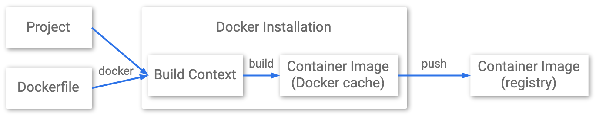

# 도커 빌드를 위한 Jenkins CI 활용

**docker tip**

> 실제 컨테이너를 사용할 때는 하나의 파일시스템처럼 보인다. 레이어로 나누어진 이미지는 UFS(union file system) 방식을 사용해서 여러개로 나누어진 파일 시스템을 하나의 파일시스템으로 만들 수 있기 때문이다.

## 1. 빌드

> `소프트웨어 빌드`는 소스 코드 파일을 컴퓨터나 휴대폰에서 실행할 수 있는 독립 소프트웨어 아티팩트로 변환하는 과정을 말하거나 그에 대한 결과물을 일컫는다. `소프트웨어 빌드`에 있어
> 가장 중요한 단계중 하나는 소스 코드 파일이 실행 코드로 변환되는 컴파일 과정이다. 컴퓨터 프로그램을 빌드하는 과정은 보통 다른 프로그램을 제어하는 프로그램인 빌드 도구에 의해 관리된다.

## 2. 빌드 방식

- 전체 빌드 : 매 빌드 떄마다 전체 코드를 포함해 빌드
- 증분 빌드 : 변경된 코드 대상만 분리해 빌드

## 3. Gradle

- Grooby를 이용한 `빌드 자동화 시스템`
- 안드로이드 스튜디오의 공식 빌드 시스템이기도 함
- JAVA, C/C++, 파이썬 등과 같은 여러 가지 언어 지원

**Gradle 빌드 3단계 :**

- 초기화 단계: 빌드할 프로젝트 설정, 생성
- 구성 단계 : 프로젝트 객체 구성, 빌드에 포함할 빌드 스크립트와 테스크 작성
- 실행 단계 : 모든 테스크 통합, 빌드 실행

**Gradle 프로젝트 구조 :**

```

- app
  - build.gradle
  - src
    - main
      - java
        - com
          - example
            - app.java
      - resources
    - test
      - java
        - com
          -example
            - AppTest.java
      - resources

- gradle
    - wrapper // gradlew 라는 파일을 실행하기 위해 필요한 파일들
        - gradle-wrapper.jar
        - gradle-wrapper.properties
- gradlew // 리눅스, macos용 gradle 실행 쉘 스크립트 파일
- gradlew.bat // window용 실행 배치
- settings.gradle

```

**build.gradle**

프로젝트 내의 소스코드에 대한 라이브러리 의존성, 플러그인 ,라이브러리 저장소를 설정하는 빌드 스크립트 파일

```gradle
plugins {
    id 'java'
    id 'org.springframework.boot' version '2.6.2'
    id 'io.spring.dependency-management' version '1.0.11.RELEASE'
    id 'com.google.cloud.tools.jib' version '3.1.4'
}

dependencies {
    implementation 'org.springframework.boot:spring-boot-starter-thymeleaf'
	implementation 'org.springframework.boot:spring-boot-starter-web'
	developmentOnly 'org.springframework.boot:spring-boot-devtools'
	testImplementation 'org.springframework.boot:spring-boot-starter-test'
}

repositories {
  mavenCentral()
}

version = '0.0.1-SNAPSHOT'
description = 'test-docker-spring-boot'
group = 'com.test'

java.sourceCompatibility = JavaVersion.VERSION_11

jar {
	enabled = false
}

tasks.withType(JavaCompile) {
    options.encoding = 'UTF-8'
}

test {
	useJUnitPlatform()
}

jib {
  from {
    image = 'adoptopenjdk/openjdk11:alpine-jre'
  }
	container {
    // entrypoint = ['java', '-Dspring.profiles.active=test', '-jar', 'test-docker-spring-boot-0.0.1-SNAPSHOT.jar']
    mainClass = 'com.test.StartApplication'
    jvmFlags = ['-Xms512m', '-Xmx512m', '-Xdebug', '-XshowSettings:vm', '-XX:+UnlockExperimentalVMOptions', '-XX:+UseContainerSupport']
		ports = ['8080']

    environment = [SPRING_OUTPUT_ANSI_ENABLED: "ALWAYS"]
    labels = [version:project.version, name:project.name, group:project.group]

    creationTime = 'USE_CURRENT_TIMESTAMP'
    format = 'Docker'
	}
  extraDirectories {
    paths {
      path {
        from = file('build/libs')
      }
    }
  }
}
```

**setting.gradle**

프로젝트 구성정보 파일

```gradle
rootProject.name = 'app'
```

## 4. Jib



- docker 데몬 없이, 그리고 docker 권장사항에 대한 깊은 숙달 없이 Java 애플리케이션에 최적화된 `docker 및 OCI 이미지`를 빌드한다
- Maven 및 Gradle용 플러그인과 자바 라이브러리로 사용할 수 있다.
- 애플리케이션을 여러 레이어로 분리해서 클래스 종속성을 분리해 변경된 레이어만 배포 가능
- 빠른 도커 이미지 빌드 및 배포
- 도커 데몬이나 도커 CLI가 없어도 Gradle내에서 도커 이미지를 빌드하고 원하는 이미지 레포지토리로 푸시 가능
- 도커 파일이 불필요함

**build.gradle의 jib 주요 설정 구문**

```
from: 베이스 이미지 설정

to : 이미지(생성된 컨테이너 이미지가 저장될 레포지토리)와 태그(설정될 태그)

container : 컨테이너 이미지가 컨테이너화 돼서 실행될때 필요한 애플리케이션 설정 지정

```

## 5. Gradle 활용한 빌드 준비

Gradle 설치 :

```sh
apt install gradle
```

Gradle Project 생성 및 빌드

```sh
gradle init --dsl=groovy --type=java-application \
    --test-framework=junit \
    --package=com.text --project-name=test-docker-spring-boot

gradle build --info
```

Jib을 이용한 Docker 빌드 및 Push 명령어

```sh
# Jib을 이용한 Docker 빌드 및 Push(DockerHub)
./gradlew jib
```

Docker pull 및 Run 명령어

```sh
docekr pull <repo:tag>

docker run -d -p 8080:8080 <docker image id>
```

## 6. Jenkins

> ssh 키 생성 및 github 적용 방법

ssh key 생성

```
ssh-keygen -b 2048 -t rsa -f ~/ssh-key/id_rsa
```

ssh key 설정 경로

```

github 메인 > 우측 profile > setting > Account settings > ssh and gpg keys
> new ssh key > title: ssh-key, key: id_rsa.pub 내용 입력 > add ssh key 눌러서 추가
```

젠킨스는 `지속적 통합 서비스`를 제공하는 툴이다.

- 다수의 개발자들이 하나의 프로그램을 개발할 때 버전 충돌을 방지하기 위해 각자 작업한 내용을 공유 영역에 있는 Git등의 저장소에 빈번히 업로드 함으로써 지속적 통합이 가능하도록 해준다.

> 다음과 같은 특징이 있다.

- 빌드 자동화
- 자동화 테스트
- 코드품질 검사, 정적 분석
- 빌드 파이프라인 구성

> 플러그인을 사용할 수 있다.

- Credential plugin: aws token, git access token 등 정보 저장할 때 사용
- pipeline plugin: 파이프라인 관리
- docker plugin : 도커 관리 플러그인

1. Jenkins 컨테이너 실행

> sg는 ssh, http, 8080 개방

```sh
  docker run --name jenkins -d -p 8080:8080 -v ~/jenkins:/var/jenkins_home -u root jenkins/jenkins:latest
```

2. Jenkins 접속 및 설치

- http://publicaddress:8000

```sh
  # Admin Password 확인
  docker exec -it jenkins bash -c "cat /var/jenkins_home/secrets/initialAdminPassword"
```

3. 관리 계정 생성 (admin 및 test)

> Timezone 설정 필요

4. 플러그인 설치

Jenkins 관리 -> plugin manager

- Job DSL
- Simple Build DSLfor Pipeline
- Docker Pipeline
- Pipeline: Declarative Agent API
- Pipeline utility Steps
- Build Pipeline
- SSH pipeline steps
- Pipeline: AWS steps
- Pipeline :Github
- git parameter
- github integration
- github athentication
- docker
- docker commons
- docker api
- docker-build-step
- cloudbees docker build and publish
- cloudbees docker custom build environment
- amazon web services SDK :: ALL
- cloudbees AWS credentials
- amazon ecr
- aws global configuration
- ssh
- ssh agent

5. 인증 설정
